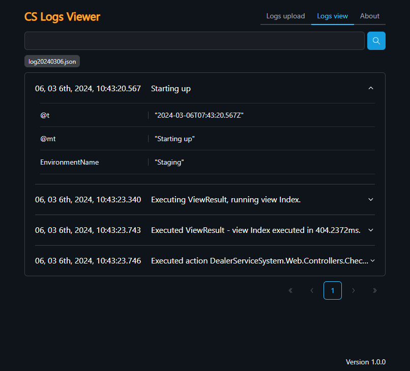

# Application purpose
CS Logs viewer is developed for viewing structured log files and filtering by logs in a projects that does not use 
centralized logging.
It's been developed as a web application to be available on both a PC and a server. 

## Features
- Viewing multiple files in Compact Log Event Format
- Filtering logs
- Launching in a Docker environment
- Storing uploaded logs in browser storage
- Supporting dark and light UI themes

## When should I use CS Logs viewer?
**In general** : use Cs Logs viewer in projects that store structure logs in files

### Possible situations for storing structure logs in files
- The project architecture is monolith 
- The project is not a high-load system
- The project is in its early stages

## Application screenshots

